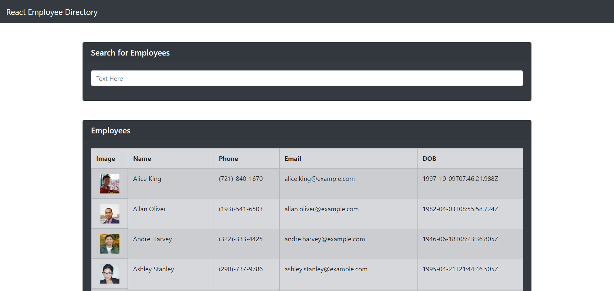

# React Employee Directory

The objective of this project was to create an employee directory that allows for easy sorting by name, phone, email, and DOB, as well as, filtering through the searchbar. React, React-Bootstrap, and Heroku were used to build and deploy this project.  A link to the deployed application can be found below.

https://pure-woodland-69227.herokuapp.com/